# SDL2 实际截图图集

> [English](screenshots.md)

以下图片均由原生 LVGL 经过 SDL2 实际渲染，尺寸为 **800×480**，不是设计稿或整屏背景素材。参见[捕获命令](../build/README.zh-CN.md)及[机器可读来源记录](screenshots/manifest.json)。

正常页面使用 `--visual mid`，异常用例使用各自命名的合成场景。每次捕获运行 180 帧。更新浮层仅预览 45% 下载进度，不是 OTA 安装。

## 主界面

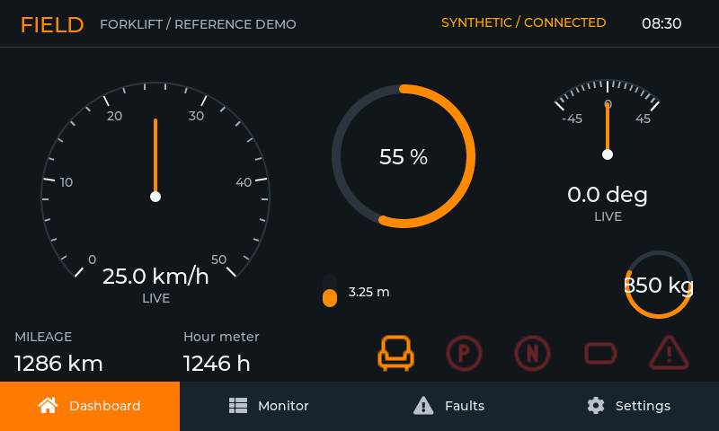

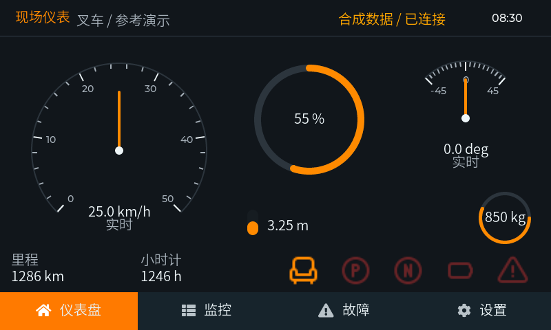

## 监测分页

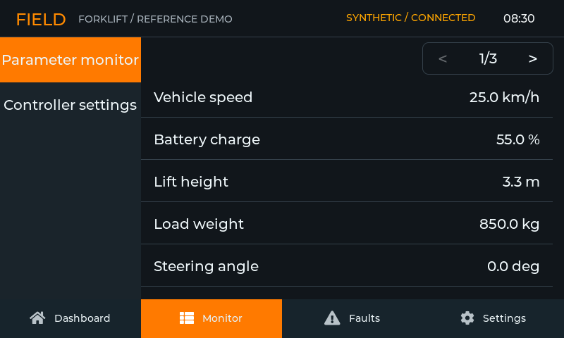

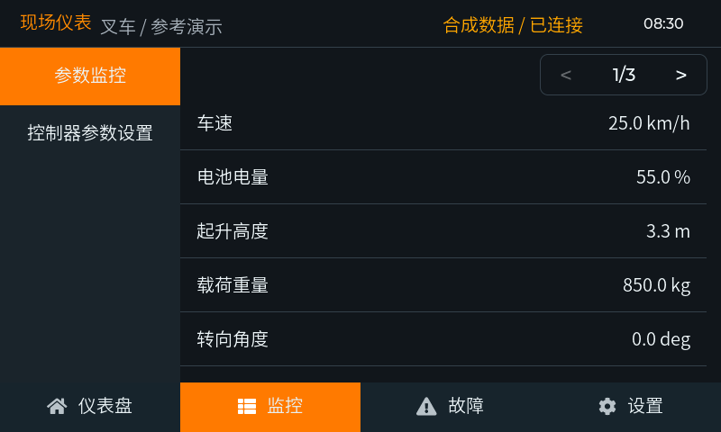

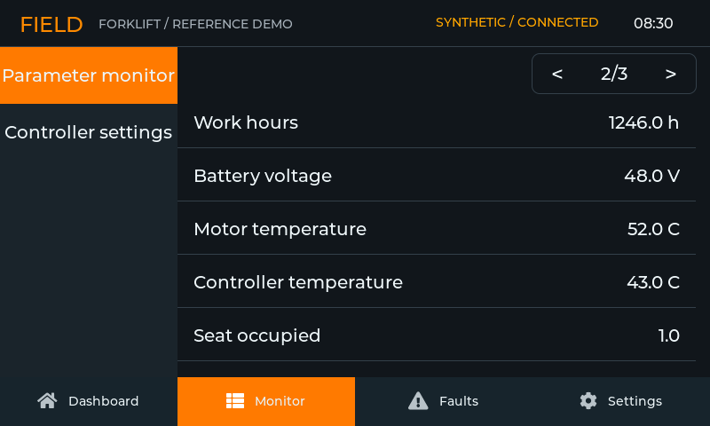

## 故障与设置

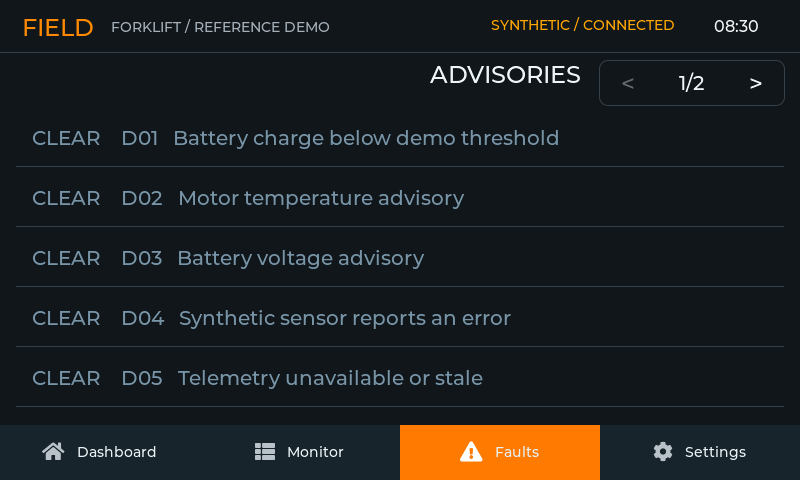

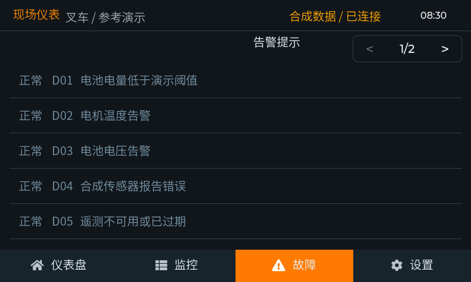

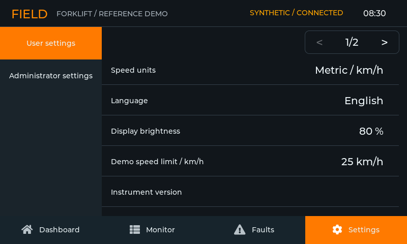

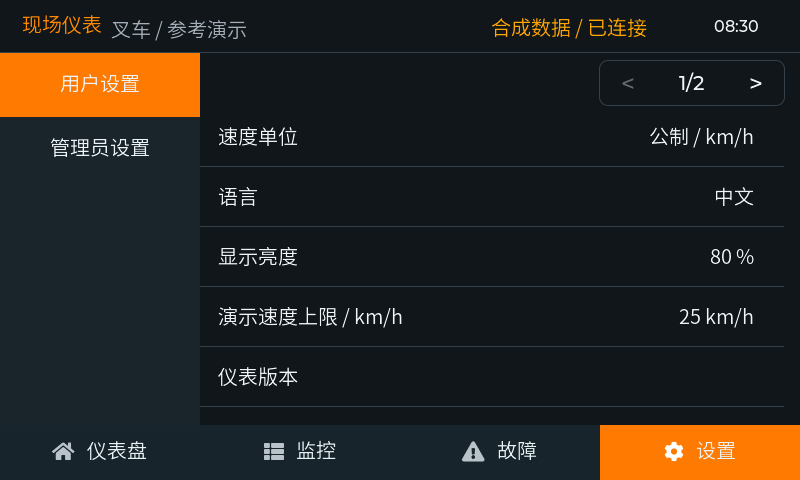

## 时钟设置

用户设置的第二页只有"时钟"这一条目，点进去就是六列轮盘。因此该用例先翻到设置第二页，再点开这个条目。

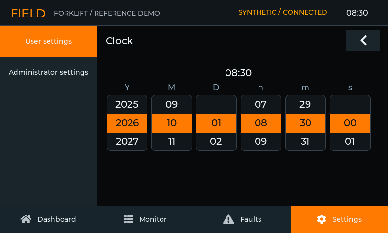

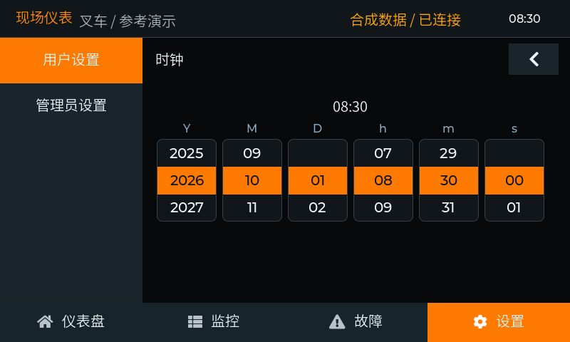

## 异常状态

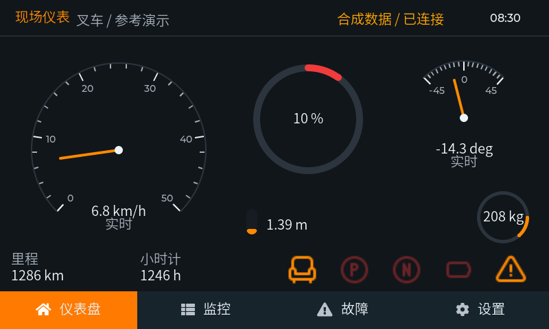

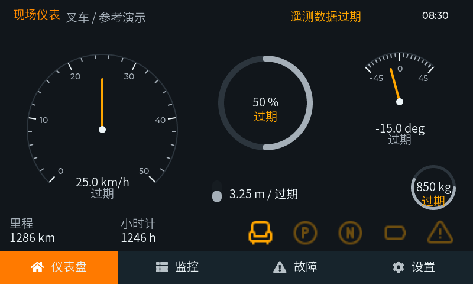

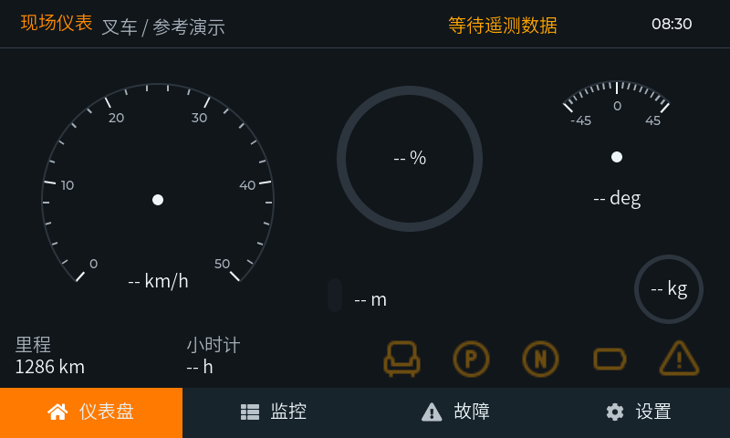

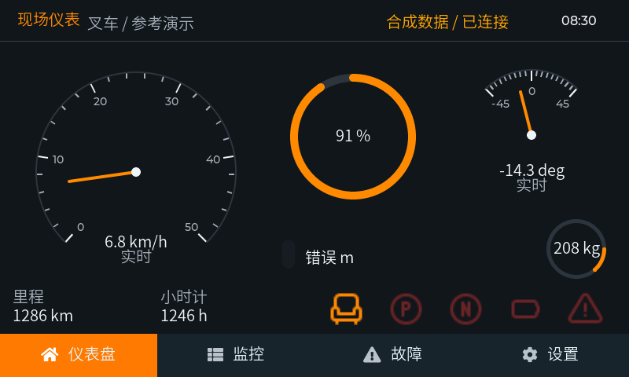

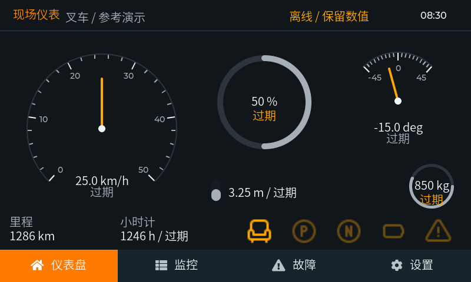

## 更新预览

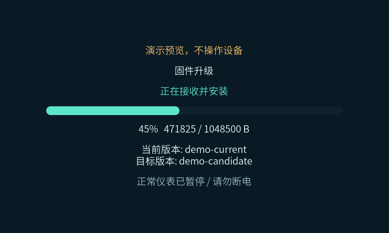
